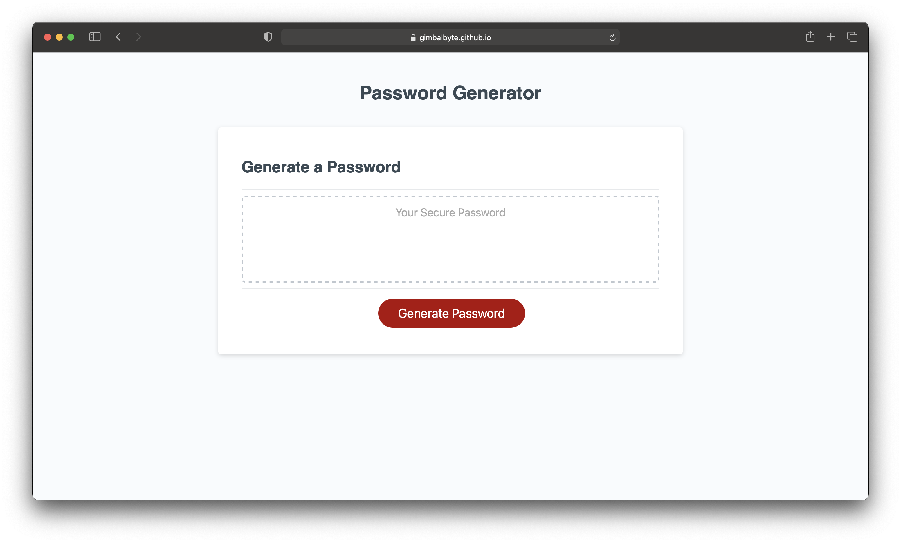

# Password_Generator

Password Generator

Description

This repository contains the code for a password generation application. The password generator is intended for the use of people to generate a password which matches criteria. The purpose of the application is to provide secure and unique passwords for security. The password generated follows the criteria of choosing if it contains uppercase, lowercase, numbers and special characters. When the criteria is chosen then a random password is generated and placed within the box for the user to copy.

The password generator was created using the base code given, and modified to generate a password. The Javascript was the main recipient of the changes made, and is the base of the applications operation. The javascript was modified to include variables and functions to help narrow and define the criteria. The javascript was also used to create the prompts.

The use of online web tools helped to facilitate the creation of the password generator. MDN was used to help review and learn more about javascript. The application runs successfully and generates random passwords that fulfill the criteria that the user selects.

Image (Note: still don't know how to take a picture of the whole webpage so it is only part of it.)
    

Link
    [Password Generator](https://gimbalbyte.github.io/Password_Generator/)